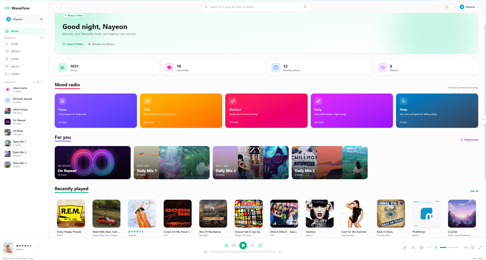
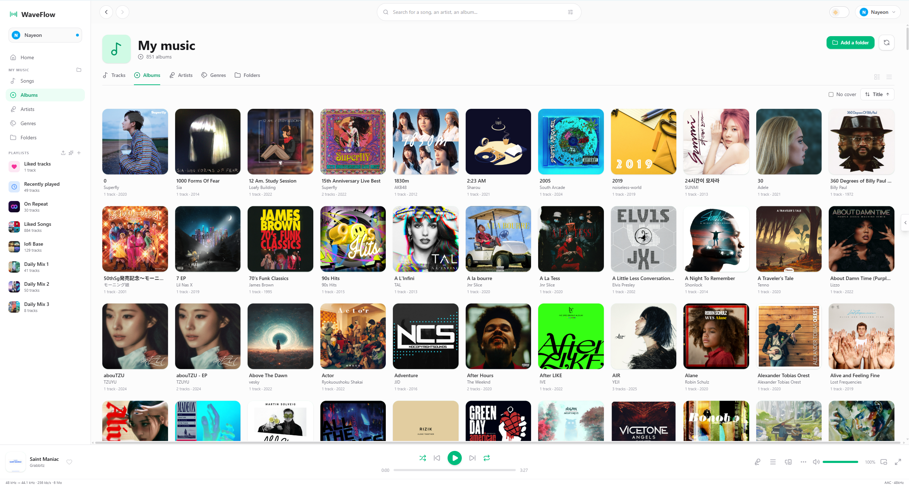
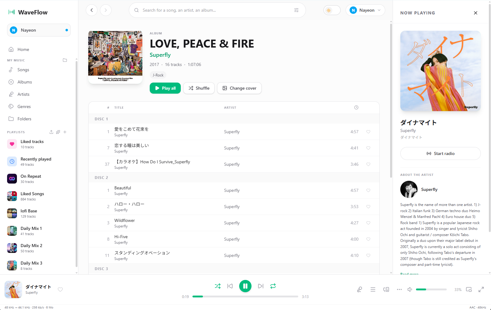
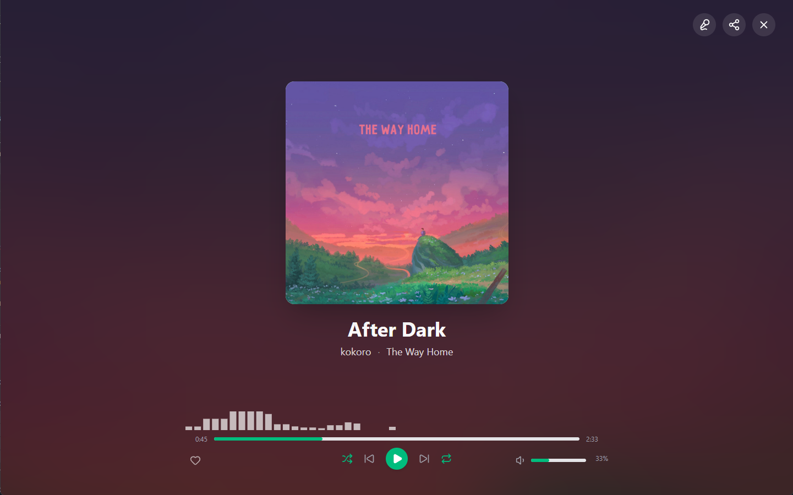
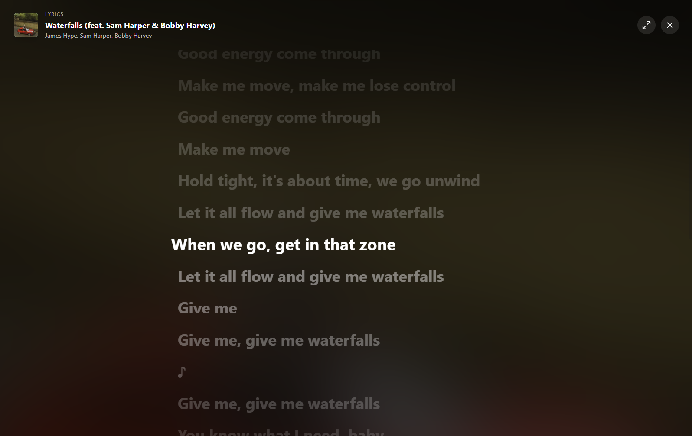
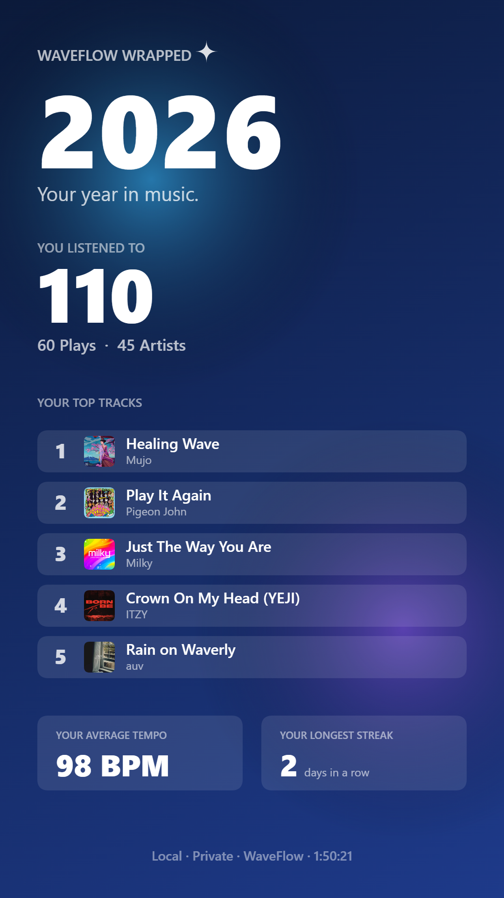

<p align="center">
  
</p>

<h1 align="center">WaveFlow</h1>

<p align="center">
  <strong>Local music player for desktop — built with Tauri 2, React 19 & Rust</strong>
</p>

<p align="center">
   <!-- x-release-please-version -->
  
  
  
  
  
  
</p>

---

WaveFlow is a local music player desktop app with a Spotify-inspired 3-panel UI. It scans your local audio folders, organizes tracks by album/artist/genre, and plays them with a real-time audio engine — no streaming, no cloud, your music stays on your machine.

**Install** — grab the bundle for your OS on the [latest release](https://github.com/InstaZDLL/WaveFlow/releases/latest); every release page lists the per-distro one-liner (AUR / COPR / apt / winget) and the standalone installers.

## Screenshots

<!-- markdownlint-disable MD033 -->
<!-- HTML table because there's no clean Markdown way to render a
     two-column image grid with captions; GitHub renders this fine. -->
<table>
  <tr>
    <td width="50%"></td>
    <td width="50%"></td>
  </tr>
  <tr>
    <td align="center"><sub><b>Home</b> · profile-aware greeting, mood radio, Daily Mix carousel</sub></td>
    <td align="center"><sub><b>Library</b> · virtualised album grid with Hi-Res badges and A-Z jump</sub></td>
  </tr>
  <tr>
    <td width="50%"></td>
    <td width="50%"></td>
  </tr>
  <tr>
    <td align="center"><sub><b>Album detail</b> · multi-disc grouping, side Now Playing panel with artist bio</sub></td>
    <td align="center"><sub><b>Immersive Now Playing</b> · full-bleed artwork with real-time spectrum visualizer</sub></td>
  </tr>
  <tr>
    <td width="50%"></td>
    <td width="50%" align="center"></td>
  </tr>
  <tr>
    <td align="center"><sub><b>Karaoke lyrics</b> · Apple-Music-style word-level highlight with click-to-seek</sub></td>
    <td align="center"><sub><b>Wrapped</b> · year-in-review with top tracks, average tempo, longest streak — local & private</sub></td>
  </tr>
</table>

<p align="center"><sub><i>Cover art shown in the screenshots above remains the property of its respective rights holders. WaveFlow is a local-file player — no music content is bundled, and you must legally own the files in your library.</i></sub></p>
<!-- markdownlint-enable MD033 -->

## Features

<!-- markdownlint-disable MD060 -->

| Area                | Highlights                                                                                                                                                                                                                                                                                                      | Deep dive                                |
| ------------------- | --------------------------------------------------------------------------------------------------------------------------------------------------------------------------------------------------------------------------------------------------------------------------------------------------------------- | ---------------------------------------- |
| **Playback**        | Symphonia + cpal, lock-free 3-thread engine, real dual-decoder crossfade, ReplayGain, variable playback speed (0.5×–2×), output-device picker, OS media controls (SMTC / MPRIS / MediaRemote), persistent queue with shuffle / repeat / auto-advance                                                            | [docs](docs/features/playback.md)        |
| **Library**         | Folder scanning + filesystem watcher, on-demand audio analysis (peak, loudness, ReplayGain, BPM), Hi-Res badges, multi-artist split, POPM 5-star ratings, A-Z navigator, multi-select action bar                                                                                                                | [docs](docs/features/library.md)         |
| **Playlists**       | Drag-and-drop reorder (virtualised), bulk add from any source, M3U import / export with basename-fallback matching, likes, recently-played                                                                                                                                                                      | [docs](docs/features/playlists.md)       |
| **Smart playlists** | Auto-generated **Daily Mix** family bucketed by tempo, with composite artist-photo covers rendered from your Deezer cache                                                                                                                                                                                       | [docs](docs/features/smart-playlists.md) |
| **Integrations**    | Deezer (artwork + labels), Last.fm (bios + scrobbling with retry queue), LRCLIB + Musixmatch (with translation language picker) / NetEase / Megalobiz / Genius lyrics, Discord Rich Presence ("Listening to WaveFlow" with cover + progress bar) — all cached locally for offline use                            | [docs](docs/features/integrations.md)    |
| **Sync & sharing**  | Opt-in **multi-device sync** against a self-hosted [waveflow-server](https://github.com/InstaZDLL/waveflow-server) (playlists, library, likes, ratings — HLC + payload-hash digest, last-write-wins, OAuth-loopback browser handshake), **public playlist share** links, optional account-bound mode per profile | docs/features/sync.md *(WIP)*            |
| **Plugins**         | RFC-002 **plugin SDK** — wasmtime sandbox with permission gates, manifest-declared host APIs, settings panel per plugin; ships the first official **Web Radio** plugin routing live streams through the cpal engine                                                                                              | docs/features/plugins.md *(WIP)*         |
| **UI & UX**         | Spotify-style 3-panel layout with **5 skins** (Studio / Editorial broadsheet / Lounge listening-room / Pulse OLED-neon / Liquid Apple Vibrancy) × 14 OKLCH theme presets, Framer Motion micro-interactions, system tray, statistics dashboard with JSON export, **WaveFlow Wrapped** year-in-review, virtual scroll for 6000+ tracks, dark mode (View Transitions API), 17 locales (RTL-aware), per-profile isolated DB with scheduled auto-backup, signed auto-updater | [docs](docs/features/ui.md)              |

<!-- markdownlint-enable MD060 -->

## Tech Stack

<!-- markdownlint-disable MD060 -->

| Layer                     | Technologies                                                                                                                       |
| ------------------------- | ---------------------------------------------------------------------------------------------------------------------------------- |
| **Desktop shell**         | Tauri 2.11 (tray icon, opener, dialog, updater, notification, single-instance plugins)                                             |
| **OS media controls**     | souvlaki 0.8 (SMTC / MPRIS / MediaRemote bridge)                                                                                   |
| **Discord Rich Presence** | discord-rich-presence 1.1 (local IPC named pipe, no auth)                                                                          |
| **Frontend**              | React 19, TypeScript, Vite 8, Tailwind CSS 4, framer-motion 12, Lucide icons, `@dnd-kit` (drag-and-drop), `@tanstack/react-virtual` (virtualization), `@fontsource` (bundled woff2 for skin typography — local-first, no Google Fonts at runtime) |
| **Backend**               | Rust, SQLite (sqlx 0.9), FTS5 contentless full-text search, BLAKE3 hashing, tokio                                                  |
| **Audio**                 | symphonia 0.6 (decode), cpal 0.17 (output), rubato 3.0 (resample), rtrb 0.3 (SPSC ring)                                            |
| **Metadata extraction**   | lofty 0.24 (tags, embedded art, POPM, INITIALKEY)                                                                                  |
| **Imaging**               | image 0.25 + fast_image_resize 6 (SIMD thumbnails) + resvg/usvg/tiny-skia (smart-playlist composite covers)                        |
| **Filesystem watcher**    | notify 8 (debounced rescans of watched folders)                                                                                    |
| **Plugin runtime**        | wasmtime + WASI p2 (RFC-002 plugin sandbox with permission gates)                                                                  |
| **External APIs**         | Deezer public API (no auth) + Last.fm (read + signed methods via md-5 + reqwest 0.12 with rustls) + LRCLIB / Musixmatch / NetEase / Megalobiz / Genius lyrics + optional [waveflow-server](https://github.com/InstaZDLL/waveflow-server) for multi-device sync |
| **Package manager**       | Bun                                                                                                                                |

<!-- markdownlint-enable MD060 -->

## Getting Started

```bash
# Install dependencies
bun install

# Run the desktop app in development mode
bun run tauri dev

# Build for production
bun run tauri build
```

## Development Commands

```bash
bun run dev          # Vite dev server only (no Tauri shell)
bun run typecheck    # TypeScript check
bun run lint         # ESLint
bun run lint:fix     # ESLint with auto-fix
bun run format       # Prettier

# Rust backend
cargo check --manifest-path src-tauri/Cargo.toml --all-targets
cargo test  --manifest-path src-tauri/Cargo.toml
```

## Documentation

Per-feature deep dives, architecture and storage layout live under [`docs/`](docs/README.md):

- **Features** — [playback](docs/features/playback.md) · [library](docs/features/library.md) · [playlists](docs/features/playlists.md) · [smart playlists](docs/features/smart-playlists.md) · [integrations](docs/features/integrations.md) · [UI & UX](docs/features/ui.md)
- **Architecture** — [audio engine](docs/architecture/audio.md) · [database & paths](docs/architecture/storage.md)
- **Contributing** — [CONTRIBUTING.md](CONTRIBUTING.md) · [RELEASING.md](RELEASING.md)

## Community

- :bug: **Bug?** → [Bug report](https://github.com/InstaZDLL/WaveFlow/issues/new?template=bug_report.yml)
- :sparkles: **Feature idea?** → [Discussions › Ideas](https://github.com/InstaZDLL/WaveFlow/discussions/categories/ideas) (chat first, graduate to a [feature request issue](https://github.com/InstaZDLL/WaveFlow/issues/new?template=feature_request.yml) once shape is clear)
- :pray: **Setup help / how-to?** → [Discussions › Q&A](https://github.com/InstaZDLL/WaveFlow/discussions/categories/q-a)
- :raised_hands: **Show off your setup or playlist?** → [Discussions › Show and tell](https://github.com/InstaZDLL/WaveFlow/discussions/categories/show-and-tell)
- :lock: **Security?** → [Private disclosure](.github/SECURITY.md) — never post vulnerabilities publicly.

English and French both welcome.

## License

```
Copyright (C) 2026 InstaZDLL

This program is free software: you can redistribute it and/or modify
it under the terms of the GNU General Public License as published by
the Free Software Foundation, either version 3 of the License, or
(at your option) any later version.

This program is distributed in the hope that it will be useful,
but WITHOUT ANY WARRANTY; without even the implied warranty of
MERCHANTABILITY or FITNESS FOR A PARTICULAR PURPOSE. See the
GNU General Public License for more details.

You should have received a copy of the GNU General Public License
along with this program. If not, see <https://www.gnu.org/licenses/>.
```

See [LICENSE](LICENSE) for the full text. Third-party notices are listed in
[THIRD_PARTY_NOTICES.md](THIRD_PARTY_NOTICES.md).
