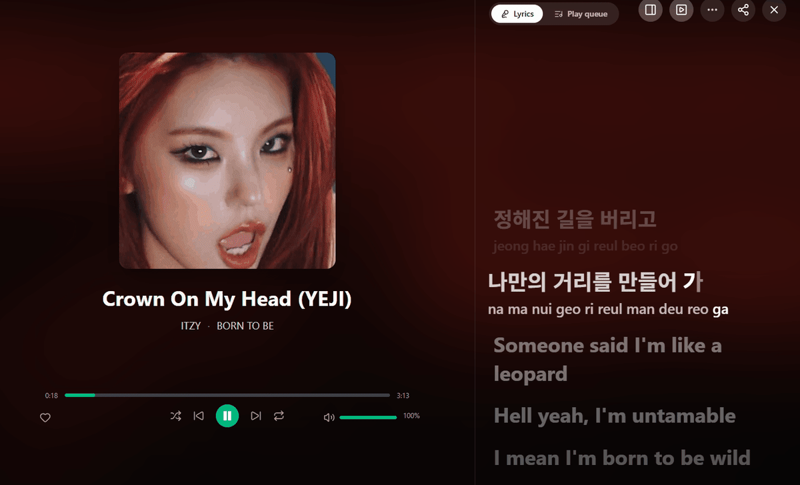
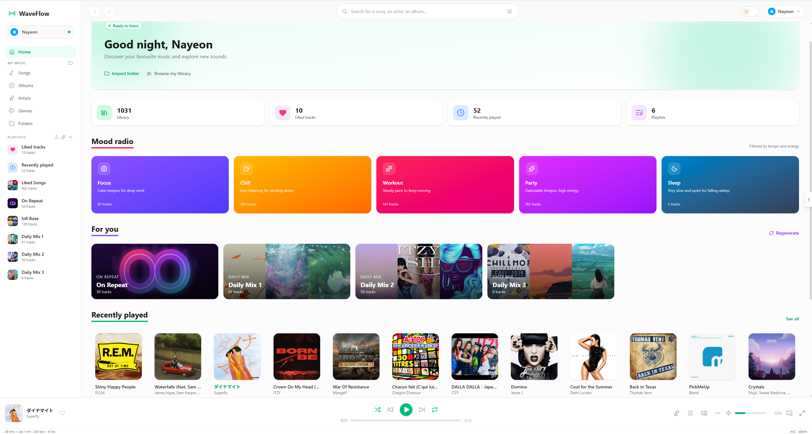
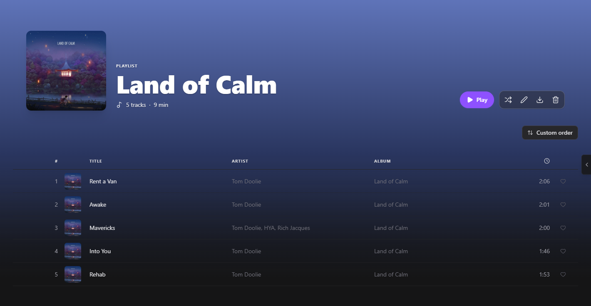
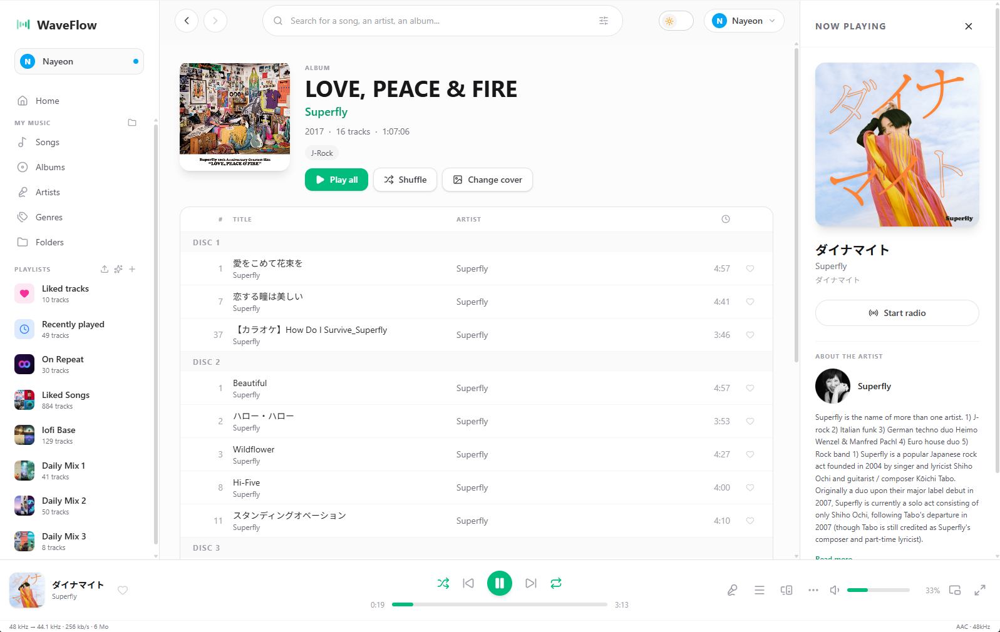
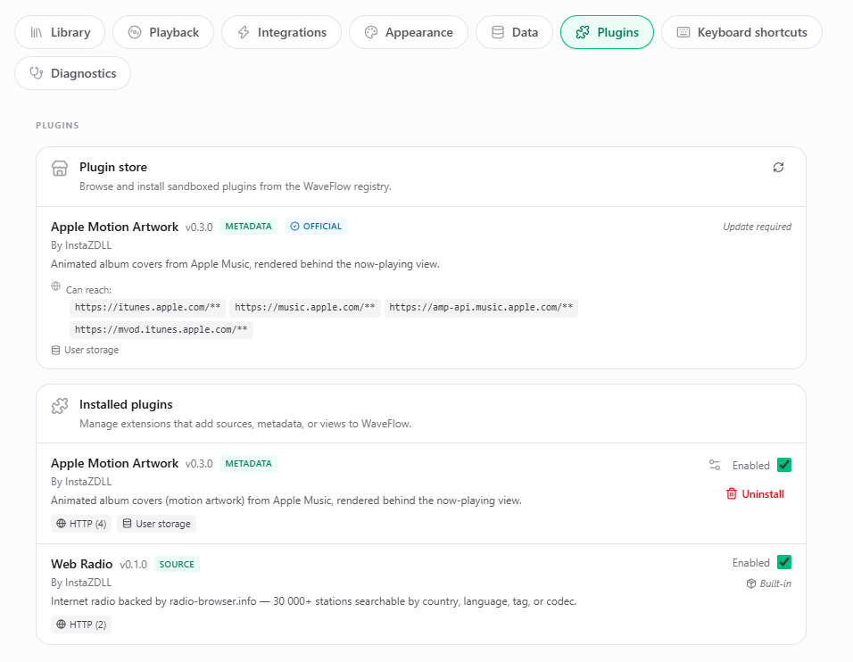
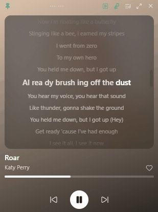
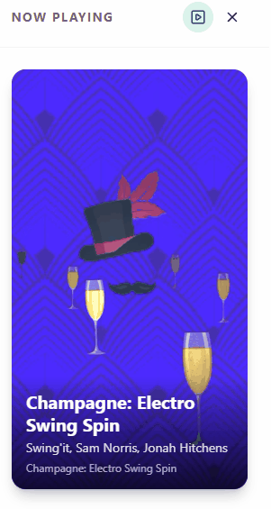

<p align="center">
  
</p>

<h1 align="center">WaveFlow</h1>

<p align="center">
  <strong>Local music player for desktop — built with Tauri 2, React 19 & Rust</strong>
</p>

<p align="center">
   <!-- x-release-please-version -->
  
  
  
  
  
  
</p>

---

WaveFlow is a desktop music player for the audio files you already own. It scans your folders, organizes everything by album, artist and genre, and plays it back through a fast, high-fidelity audio engine. No subscription, no streaming service, no account: your music stays on your machine.

**Install** — grab the bundle for your OS on the [latest release](https://github.com/InstaZDLL/WaveFlow/releases/latest); every release page lists the per-distro one-liner (AUR / COPR / apt / winget) and the standalone installers.

## Screenshots

<!-- markdownlint-disable MD033 -->
<p align="center">
  
  <br />
  <sub><b>Immersive view</b> · Canvas clip, lyrics synced word by word, romanization under each line</sub>
</p>

<table>
  <tr>
    <td width="50%"></td>
    <td width="50%"></td>
  </tr>
  <tr>
    <td align="center"><sub><b>Home</b> · mood radio, Daily Mix, recently played</sub></td>
    <td align="center"><sub><b>Playlists</b> · the header takes its colour from the cover</sub></td>
  </tr>
  <tr>
    <td width="50%"></td>
    <td width="50%"></td>
  </tr>
  <tr>
    <td align="center"><sub><b>Album</b> · multi-disc grouping, Now Playing panel with artist bio</sub></td>
    <td align="center"><sub><b>Plugin store</b> · verified installs, one click</sub></td>
  </tr>
  <tr>
    <td width="50%" align="center"></td>
    <td width="50%" align="center"></td>
  </tr>
  <tr>
    <td align="center"><sub><b>Mini-player</b> · always on top, lyrics word by word</sub></td>
    <td align="center"><sub><b>Now Playing panel</b> · the Canvas clip loops in place of the cover</sub></td>
  </tr>
</table>

<br />

<p align="center">
  
  <br />
  <sub><b>Desktop lyrics</b> · a floating line above every window</sub>
</p>

<p align="center"><sub><i>Album artwork shown in the screenshots belongs to its respective rights holders. WaveFlow does not bundle or distribute any music.</i></sub></p>
<!-- markdownlint-enable MD033 -->

## Features

### 🎧 Playback · [docs](docs/features/playback.md)

- MP3, FLAC, WAV, AIFF, Ogg Vorbis, **Opus**, AAC, ALAC and **DSD**
- Gapless playback and a real two-decoder crossfade
- **Exclusive output** on Windows, Linux and macOS, and **DSD over PCM (DoP)**, which sends DSD untouched to a compatible DAC (opt-in)
- ReplayGain, 6-band EQ with presets, speed 0.5×–2×, A-B repeat, sleep timer
- Seed and mood radio, album shuffle, OS media controls, a queue that survives a restart

### 🎤 Lyrics · [docs](docs/features/integrations.md)

- Synced lyrics from LRCLIB, Musixmatch, NetEase, Megalobiz and Genius — or from a plugin
- Word-by-word karaoke, with the word timing estimated when a provider only has lines
- Romanization for Japanese, Korean and Chinese, and translations beside the original
- In the lyrics panel, the immersive view, the mini-player and a floating desktop window

### 📚 Library · [docs](docs/features/library.md)

- Folder scan with a live watcher; browse by album, artist, genre or folder
- Search and filters, with pinyin for Chinese titles
- A tag editor that keeps every tag it does not edit, and 5-star ratings written back to your files
- Duplicates, a "Needs attention" tab, multi-artist split
- Hi-Res badges, loudness and BPM analysis

### 🎶 Playlists · [docs](docs/features/playlists.md) · [smart playlists](docs/features/smart-playlists.md)

- Drag-and-drop, M3U import and export, a header coloured from the cover
- Smart playlists built from rules, with a live count
- **Daily Mix** and **On Repeat**, generated from what you play

### 🎨 Interface · [docs](docs/features/ui.md)

- 5 skins × 14 themes, dark mode, a high-contrast mode
- Immersive now-playing with Canvas clips, animated covers and a cover slideshow
- Always-on-top mini-player, system tray, Windows taskbar buttons
- Statistics and **WaveFlow Wrapped**, all computed locally
- 17 languages including right-to-left, a separate library per profile, automatic backups

### 🔌 Connections · [docs](docs/features/integrations.md)

- Deezer artwork, Last.fm bios and scrobbling, TheAudioDB, Discord Rich Presence
- Optional [DLNA / UPnP server](docs/features/dlna.md) and [MPD server](docs/features/mpd.md), so the clients you already use can play from or control WaveFlow
- Your own [waveflow-server](https://github.com/InstaZDLL/waveflow-server): its catalogue joins your library, and favourites, ratings and playlists follow you across devices ([RFC-005](docs/rfcs/RFC-005-remote-source-and-sync-v2.md))
- Everything fetched is cached locally, and an offline mode cuts all network access

### 🧩 Plugins · [docs](docs/features/plugins.md) · [RFC-002](docs/rfcs/RFC-002-plugin-sdk.md)

- Sandboxed WebAssembly plugins with permissions, from an in-app store with verified installs
- Official plugins: **Web Radio** (30 000+ stations), **Apple Motion Artwork** (animated covers) and **Release Radar** (new releases from your artists)

## Tech Stack

- **App** — Tauri 2 · Rust · SQLite (sqlx, FTS5) · tokio
- **Frontend** — React 19 · TypeScript · Vite · Tailwind CSS 4 · Framer Motion
- **Audio** — symphonia + libopus (decoding) · cpal (output) · rubato (resampling) · rtrb (lock-free ring buffer)
- **Metadata & images** — lofty · image + fast_image_resize · resvg
- **Plugins** — wasmtime + WASI p2
- **Toolchain** — Bun

## Getting Started

Requires Bun, Rust and the platform dependencies listed in [CONTRIBUTING.md](docs/CONTRIBUTING.md#requirements).

```bash
# Install dependencies
bun install

# Run the desktop app in development mode
bun run tauri dev

# Build for production
bun run tauri build
```

## Development Commands

```bash
bun run dev          # Vite dev server only (no Tauri shell)
bun run typecheck    # TypeScript check
bun run lint         # ESLint
bun run lint:fix     # ESLint with auto-fix
bun run format       # Prettier

# Rust backend
cargo check --manifest-path src-tauri/Cargo.toml --all-targets
cargo test  --manifest-path src-tauri/Cargo.toml
```

## Documentation

Per-feature deep dives, architecture and storage layout live under [`docs/`](docs/README.md):

- **Features** — [playback](docs/features/playback.md) · [library](docs/features/library.md) · [playlists](docs/features/playlists.md) · [smart playlists](docs/features/smart-playlists.md) · [integrations](docs/features/integrations.md) · [plugins](docs/features/plugins.md) · [DLNA / UPnP](docs/features/dlna.md) · [MPD](docs/features/mpd.md) · [UI & UX](docs/features/ui.md)
- **Architecture** — [cross-cutting invariants](docs/architecture/invariants.md) · [crate layout](docs/architecture/crates.md) · [audio engine](docs/architecture/audio.md) · [database & paths](docs/architecture/storage.md)
- **Contributing** — [CONTRIBUTING.md](docs/CONTRIBUTING.md) · [RELEASING.md](docs/RELEASING.md)

## Community

- :bug: **Bug?** → [Bug report](https://github.com/InstaZDLL/WaveFlow/issues/new?template=bug_report.yml)
- :sparkles: **Feature idea?** → [Discussions › Ideas](https://github.com/InstaZDLL/WaveFlow/discussions/categories/ideas) (chat first, graduate to a [feature request issue](https://github.com/InstaZDLL/WaveFlow/issues/new?template=feature_request.yml) once shape is clear)
- :pray: **Setup help / how-to?** → [Discussions › Q&A](https://github.com/InstaZDLL/WaveFlow/discussions/categories/q-a)
- :raised_hands: **Show off your setup or playlist?** → [Discussions › Show and tell](https://github.com/InstaZDLL/WaveFlow/discussions/categories/show-and-tell)
- :lock: **Security?** → [Private disclosure](.github/SECURITY.md) — never post vulnerabilities publicly.

English and French both welcome.

## License

```
Copyright (C) 2026 InstaZDLL

This program is free software: you can redistribute it and/or modify
it under the terms of the GNU General Public License as published by
the Free Software Foundation, either version 3 of the License, or
(at your option) any later version.

This program is distributed in the hope that it will be useful,
but WITHOUT ANY WARRANTY; without even the implied warranty of
MERCHANTABILITY or FITNESS FOR A PARTICULAR PURPOSE. See the
GNU General Public License for more details.

You should have received a copy of the GNU General Public License
along with this program. If not, see <https://www.gnu.org/licenses/>.
```

See [LICENSE](LICENSE) for the full text. Third-party notices are listed in
[THIRD_PARTY_NOTICES.md](THIRD_PARTY_NOTICES.md).
